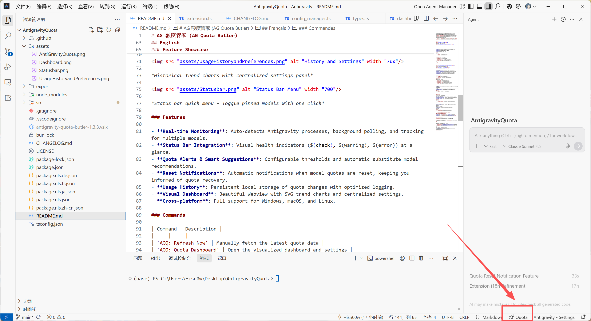
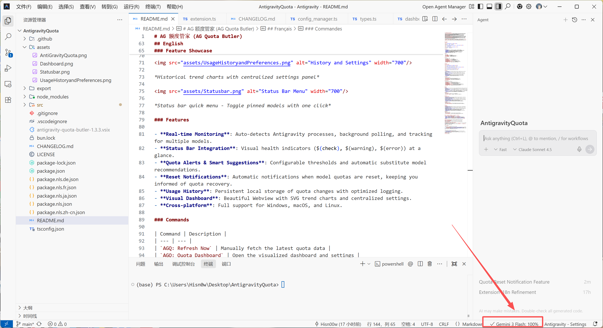

# AG 额度管家 (AG Quota Butler)

[简体中文](#简体中文) | [English](#english) | [日本語](#日本語) | [Français](#français) | [Deutsch](#deutsch) | [Open VSX](https://open-vsx.org/extension/hisn00w/antigravity-quota-butler) | [Marketplace](https://marketplace.visualstudio.com/items?itemName=hisn00w.antigravity-quota-butler)

---

## 简体中文

### 快速开始

**状态栏使用说明**：

*默认状态 - 未选择模型时，右下角状态栏显示 "Quota"*

*选择模型后 - 点击 Quota 选择模型后，状态栏会显示相应的模型名称及额度*

### 功能展示

*可视化仪表盘 - 一目了然掌握所有模型状态*

*历史趋势图表与中心化设置面板*

*状态栏快速菜单 - 一键切换固定模型*

### 功能特性

- **实时额度监控**：自动检测 Antigravity 进程，后台定期轮询，支持多模型跟踪。
- **状态栏集成**：直接在状态栏通过图标（$(check), $(warning), $(error)）展示额度健康状况。
- **额度报警与智能建议**：自定义告警阈值，额度不足时自动寻找并建议同级替代模型。
- **额度重置提醒**：当模型额度重置完成时自动发送通知，帮助您及时了解额度恢复情况。
- **消耗趋势追踪**：本地持久化存储额度变化，智能差异化记录。
- **可视化仪表盘**：精美的 Webview 面板，包含 SVG 趋势折线图和中心化设置入口。
- **跨平台**：完全支持 Windows, macOS 和 Linux。

### 命令

| 命令 | 说明 |
| --- | --- |
| `AGQ: 立即刷新` | 手动刷新额度数据 |
| `AGQ: 额度仪表盘` | 打开全屏可视化仪表盘与设置中心 |
| `AGQ: 重新连接进程` | 强制重新扫描 Antigravity 服务进程 |
| `AGQ: 显示调试日志` | 查看详细运行日志，用于排障 |

### 配置

| 设置 | 默认值 | 说明 |
| --- | --- | --- |
| `agq.enabled` | `true` | 启用/禁用额度监控 |
| `agq.pollingInterval` | `120` | 轮询间隔（秒）（最小 30s） |
| `agq.pinnedModels` | `[]` | 在状态栏固定的模型 ID |
| `agq.warningThreshold` | `20` | 告警阈值（百分比） |
| `agq.enableNotifications` | `true` | 启用额度低于阈值时的桌面通知 |
| `agq.autoSwitchModels` | `false` | 是否开启智能切换建议 |
| `agq.enableResetNotification` | `false` | 启用额度重置完成时的通知提醒 |
| `agq.language` | `auto` | 界面语言（auto/zh-cn/en/ja/fr/de） |

---

## English

### Quick Start

**Status Bar Usage**:

*Default State - When no model is selected, the status bar shows "Quota"*

*After Selection - Click Quota to select a model, then the status bar displays the model name and quota*

### Feature Showcase

*Visual Dashboard - Monitor all model statuses at a glance*

*Historical trend charts with centralized settings panel*

*Status bar quick menu - Toggle pinned models with one click*

### Features

- **Real-time Monitoring**: Auto-detects Antigravity processes, background polling, and tracking for multiple models.
- **Status Bar Integration**: Visual health indicators ($(check), $(warning), $(error)) at a glance.
- **Quota Alerts & Smart Suggestions**: Configurable thresholds and automatic substitute model recommendations.
- **Reset Notifications**: Automatic notifications when model quotas are reset, keeping you informed of quota recovery.
- **Usage History**: Persistent local storage of quota changes with optimized logging.
- **Visual Dashboard**: Beautiful Webview with SVG trend charts and centralized settings.
- **Cross-platform**: Full support for Windows, macOS, and Linux.

### Commands

| Command | Description |
| --- | --- |
| `AGQ: Refresh Now` | Manually fetch the latest quota data |
| `AGQ: Quota Dashboard` | Open the visualized dashboard and settings |
| `AGQ: Reconnect Process` | Force rescan for Antigravity service process |
| `AGQ: Show Debug Logs` | Open the log panel for troubleshooting |

### Configuration

| Setting | Default | Description |
| --- | --- | --- |
| `agq.enabled` | `true` | Enable/disable quota monitoring |
| `agq.pollingInterval` | `120` | Polling interval in seconds (min 30s) |
| `agq.pinnedModels` | `[]` | Model IDs to pin in the status bar |
| `agq.warningThreshold` | `20` | Warning threshold percentage |
| `agq.enableNotifications` | `true` | Enable desktop notifications when quota is low |
| `agq.autoSwitchModels` | `false` | Enable/disable smart model suggestions |
| `agq.enableResetNotification` | `false` | Enable notifications when quotas are reset |
| `agq.language` | `auto` | Language preference (auto/en/zh-cn/ja/fr/de) |

---

## 日本語

### クイックスタート

**ステータスバーの使い方**：

*デフォルト状態 - モデルが選択されていない場合、ステータスバーに "Quota" が表示されます*

*選択後 - Quota をクリックしてモデルを選択すると、ステータスバーにモデル名とクォータが表示されます*

### 特徴
- **リアルタイム監視**: Antigravityプロセスを自動検出し、バックグラウンドでポーリングを行い、複数のモデルを追跡します。
- **ステータスバー統合**: ステータスバーのアイコン（$(check), $(warning), $(error)）で、クォータの状態を一目で確認できます。
- **クォータアラートとスマートな提案**: しきい値を設定可能で、クォータが不足した際に代替モデルを自動的に推奨します。
- **リセット通知**: モデルのクォータがリセットされたときに自動的に通知し、クォータの回復状況を把握できます。
- **使用履歴**: クォータの変動をローカルに保存し、最適化されたログを保持します。
- **ビジュアルダッシュボード**: SVGトレンドチャートと設定機能を集約した美しいWebviewパネル。

### コマンド
| コマンド | 説明 |
| --- | --- |
| `AGQ: 今すぐ更新` | 最新のクォータデータを手動で取得します |
| `AGQ: クォータダッシュボード` | 可視化されたダッシュボードと設定を開きます |

---

## Français

### Démarrage rapide

**Utilisation de la barre d'état** :

*État par défaut - Lorsqu'aucun modèle n'est sélectionné, la barre d'état affiche "Quota"*

*Après sélection - Cliquez sur Quota pour sélectionner un modèle, puis la barre d'état affiche le nom du modèle et le quota*

### Caractéristiques
- **Surveillance en temps réel**: Détection automatique des processus Antigravity, scrutation en arrière-plan et suivi de plusieurs modèles.
- **Intégration de la barre d'état**: Indicateurs visuels ($(check), $(warning), $(error)) pour un aperçu rapide de l'état des quotas.
- **Alertes et suggestions intelligentes**: Seuils configurables et recommandations automatiques de modèles de remplacement.
- **Notifications de réinitialisation**: Notifications automatiques lorsque les quotas des modèles sont réinitialisés, vous tenant informé de la récupération des quotas.
- **Historique d'utilisation**: Stockage local persistant des variations de quotas.
- **Tableau de bord visuel**: Superbe panneau Webview avec graphiques de tendance SVG.

### Commandes
| Commande | Description |
| --- | --- |
| `AGQ: Actualiser maintenant` | Récupère manuellement les dernières données de quota |
| `AGQ: Tableau de bord des quotas` | Ouvre le tableau de bord visualisé et les paramètres |

---

## Deutsch

### Schnellstart

**Verwendung der Statusleiste**:

*Standardzustand - Wenn kein Modell ausgewählt ist, zeigt die Statusleiste "Quota" an*

*Nach Auswahl - Klicken Sie auf Quota, um ein Modell auszuwählen, dann zeigt die Statusleiste den Modellnamen und das Kontingent an*

### Funktionen
- **Echtzeit-Überwachung**: Automatische Erkennung von Antigravity-Prozessen, Hintergrundabfrage und Verfolgung mehrerer Modelle.
- **Statusleisten-Integration**: Visuelle Gesundheitsindikatoren ($(check), $(warning), $(error)) auf einen Blick.
- **Quoten-Warnungen & intelligente Vorschläge**: Konfigurierbare Schwellenwerte und automatische Empfehlungen für Ersatzmodelle.
- **Rücksetz-Benachrichtigungen**: Automatische Benachrichtigungen, wenn Modellkontingente zurückgesetzt werden, damit Sie über die Kontingenterholung informiert bleiben.
- **Nutzungsverlauf**: Persistente lokale Speicherung von Quotenänderungen.
- **Visuelles Dashboard**: Schönes Webview-Panel mit SVG-Trenddiagrammen und zentralisierten Einstellungen.

### Befehle
| Befehl | Beschreibung |
| --- | --- |
| `AGQ: Jetzt aktualisieren` | Manuelle Abfrage der neuesten Quotendaten |
| `AGQ: Quoten-Dashboard` | Öffnet das visualisierte Dashboard und die Einstellungen |

---

## 安装 / Installation / インストール / Installation / Installation

### 方式 A：Antigravity IDE (推荐/Recommended)
- **中文**: 在 **Antigravity IDE** 的扩展视图中搜索 **`AG 额度管家`**。
- **English**: Search for **`AG Quota Butler`** in the **Antigravity IDE** Extensions view.
- **日本語**: **Antigravity IDE** の拡張機能ビューで **`AG Quota Butler`** を検索します。
- **Français**: Recherchez **`AG Quota Butler`** dans la vue Extensions d'**Antigravity IDE**.
- **Deutsch**: Suchen Sie in der Erweiterungsansicht der **Antigravity IDE** nach **`AG Quota Butler`**.

[View on Open VSX](https://open-vsx.org/extension/hisn00w/antigravity-quota-butler)

### 方式 B：VS Code Marketplace
Search for **`AG Quota Butler`** in the VS Code Extensions view and click Install.
[View on Marketplace](https://marketplace.visualstudio.com/items?itemName=hisn00w.antigravity-quota-butler)

### 方式 C：手动安装 / Method C: Manual Installation
1. 下载最新的 `.vsix` 文件 / Download the latest `.vsix` from [Releases](https://github.com/Hisn00w/Antigravity-Quota-Butler/releases/latest)
2. 在 VS Code 中从 VSIX 安装 / Install from VSIX in VS Code (`Extensions -> ... -> Install from VSIX`)
3. 重启 VS Code / Restart VS Code

## 感谢 / Credits

本项目灵感源自并基于以下优秀开源项目进行深度开发与增强：

1.  **[AntigravityQuotaWatcher](https://github.com/wusimpl/AntigravityQuotaWatcher)**：提供了核心的进程检测与额度获取逻辑基础。感谢其作者 [wusimpl](https://github.com/wusimpl) 的卓越贡献。
2.  **[AntigravityQuota](https://github.com/Hisn00w/Antigravity-Quota-Butler)**：本项目的当前官方维护仓库，在此基础上增加了仪表盘、历史追踪及智能建议等特性。

---

Special thanks to the following open-source projects:

1.  **AntigravityQuotaWatcher**: Provided the initial logic for process detection and quota retrieval. Many thanks to [wusimpl](https://github.com/wusimpl).
2.  **AntigravityQuota**: The current home of this project, featuring the new dashboard, history tracking, and smart suggestions.
## 许可证 / License

[MIT License](LICENSE)
