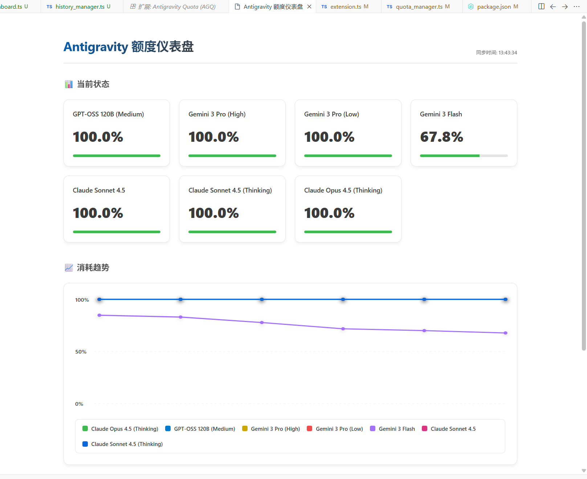
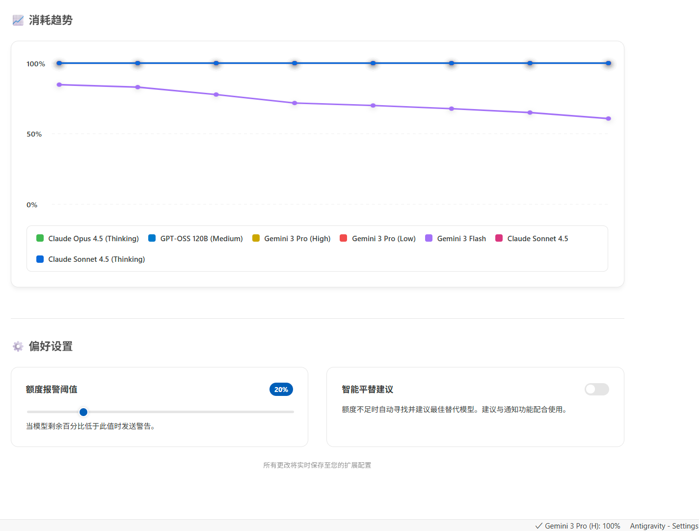
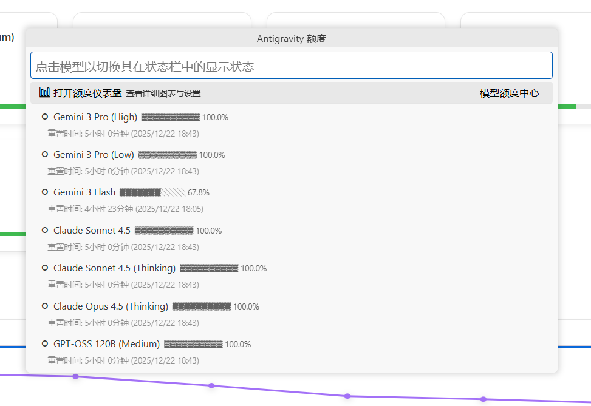

# AG 额度管家 (AG Quota Butler)

[简体中文](#简体中文) | [English](#english) | [Open VSX](https://open-vsx.org/extension/hisn00w/antigravity-quota-butler) | [VS Code Marketplace](https://marketplace.visualstudio.com/items?itemName=hisn00w.antigravity-quota-butler)

---

## 简体中文

### 功能展示

*可视化仪表盘 - 一目了然掌握所有模型状态*

*历史趋势图表与中心化设置面板*

*状态栏快速菜单 - 一键切换固定模型*

### 功能特性

- **实时额度监控**：自动检测 Antigravity 进程，后台定期轮询，支持多模型跟踪。
- **状态栏集成**：直接在状态栏通过图标（$(check), $(warning), $(error)）展示额度健康状况。
- **额度报警与智能建议**：自定义告警阈值，额度不足时自动寻找并建议同级替代模型。
- **消耗趋势追踪**：本地持久化存储额度变化，智能差异化记录。
- **可视化仪表盘**：精美的 Webview 面板，包含 SVG 趋势折线图和中心化设置入口。
- **跨平台**：完全支持 Windows, macOS 和 Linux。

### 命令

| 命令 | 说明 |
| --- | --- |
| `AGQ: 立即刷新` | 手动刷新额度数据 |
| `AGQ: 额度仪表盘` | 打开全屏可视化仪表盘与设置中心 |
| `AGQ: 重新连接进程` | 强制重新扫描 Antigravity 服务进程 |
| `AGQ: 显示调试日志` | 查看详细运行日志，用于排障 |

### 配置

| 设置 | 默认值 | 说明 |
| --- | --- | --- |
| `agq.enabled` | `true` | 启用/禁用额度监控 |
| `agq.pollingInterval` | `120` | 轮询间隔（秒）（最小 30s） |
| `agq.pinnedModels` | `[]` | 在状态栏固定的模型 ID |
| `agq.warningThreshold` | `20` | 告警阈值（百分比） |
| `agq.autoSwitchModels` | `false` | 是否开启智能切换建议 |

---

## English

### Feature Showcase

*Visual Dashboard - Monitor all model statuses at a glance*

*Historical trend charts with centralized settings panel*

*Status bar quick menu - Toggle pinned models with one click*

### Features

- **Real-time Monitoring**: Auto-detects Antigravity processes, background polling, and tracking for multiple models.
- **Status Bar Integration**: Visual health indicators ($(check), $(warning), $(error)) at a glance.
- **Quota Alerts & smart Suggestions**: Configurable thresholds and automatic substitute model recommendations.
- **Usage History**: Persistent local storage of quota changes with optimized logging.
- **Visual Dashboard**: Beautiful Webview with SVG trend charts and centralized settings.
- **Cross-platform**: Full support for Windows, macOS, and Linux.

### Commands

| Command | Description |
| --- | --- |
| `AGQ: Refresh Now` | Manually fetch the latest quota data |
| `AGQ: Quota Dashboard` | Open the visualized dashboard and settings |
| `AGQ: Reconnect Process` | Force rescan for Antigravity service process |
| `AGQ: Show Debug Logs` | Open the log panel for troubleshooting |

### Configuration

| Setting | Default | Description |
| --- | --- | --- |
| `agq.enabled` | `true` | Enable/disable quota monitoring |
| `agq.pollingInterval` | `120` | Polling interval in seconds (min 30s) |
| `agq.pinnedModels` | `[]` | Model IDs to pin in the status bar |
| `agq.warningThreshold` | `20` | Warning threshold percentage |
| `agq.autoSwitchModels` | `false` | Enable/disable smart model suggestions |

---

## 安装 / Installation

### 方式 A：Antigravity IDE 扩展商店 (推荐) / Method A: Antigravity IDE Extension Store (Recommended)
在 **Antigravity IDE** 的扩展视图中搜索 **`AG 额度管家`** 或 **`AG Quota Butler`** 并点击安装。
Search for **`AG 额度管家`** or **`AG Quota Butler`** in the **Antigravity IDE** Extensions view and click Install.

> 💡 **提示 / Tip**: Antigravity IDE 默认使用 Open VSX Registry，可以直接搜索安装本插件。

[View on Open VSX](https://open-vsx.org/extension/hisn00w/antigravity-quota-butler)

### 方式 B：VS Code 市场 / Method B: VS Code Marketplace
在 VS Code 扩展视图中搜索 **`AG 额度管家`** 或 **`AG Quota Butler`** 并点击安装。
Search for **`AG 额度管家`** or **`AG Quota Butler`** in the VS Code Extensions view and click Install.
[View on Marketplace](https://marketplace.visualstudio.com/items?itemName=hisn00w.antigravity-quota-butler)

### 方式 C：手动安装 / Method C: Manual Installation
1. 下载最新的 `.vsix` 文件 / Download the latest `.vsix` from [Releases](https://github.com/Hisn00w/Antigravity-Quota-Butler/releases/latest)
2. 在 VS Code 中从 VSIX 安装 / Install from VSIX in VS Code (`Extensions -> ... -> Install from VSIX`)
3. 重启 VS Code / Restart VS Code

## 感谢 / Credits

本项目灵感源自并基于以下优秀开源项目进行深度开发与增强：

1.  **[AntigravityQuotaWatcher](https://github.com/wusimpl/AntigravityQuotaWatcher)**：提供了核心的进程检测与额度获取逻辑基础。感谢其作者 [wusimpl](https://github.com/wusimpl) 的卓越贡献。
2.  **[AntigravityQuota](https://github.com/Hisn00w/Antigravity-Quota-Butler)**：本项目的当前官方维护仓库，在此基础上增加了仪表盘、历史追踪及智能建议等特性。

---

Special thanks to the following open-source projects:

1.  **AntigravityQuotaWatcher**: Provided the initial logic for process detection and quota retrieval. Many thanks to [wusimpl](https://github.com/wusimpl).
2.  **AntigravityQuota**: The current home of this project, featuring the new dashboard, history tracking, and smart suggestions.
## 许可证 / License

[MIT License](LICENSE)
